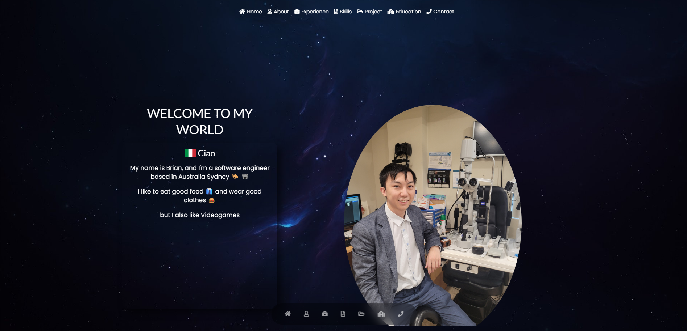
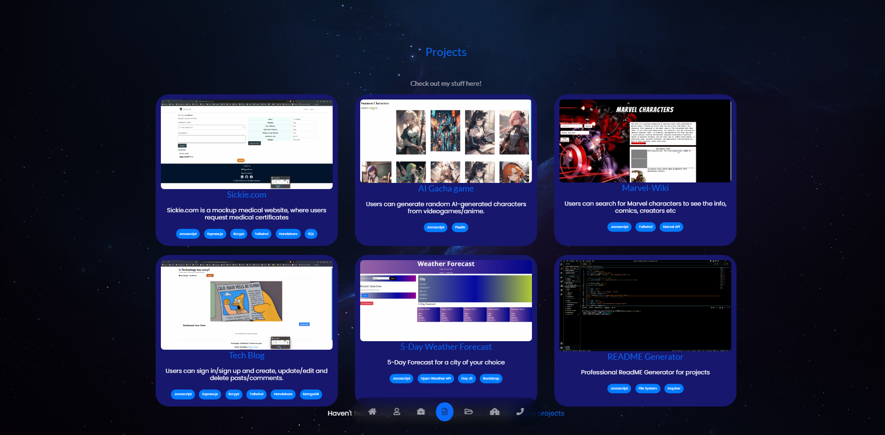

# Brian Trang || Portoflio 
You stumbled onto something great have a look around!  
https://brian-trang-portfolio.netlify.app/   


[](https://app.netlify.com/sites/brian-trang-portfolio/deploys)


## 📄 Description 
Contains About Me, Experience, Skills, Projects, Contact, Resume, Email, Footer  
also contains humour!  
 
## 🪛 Technologies used 
<p><a href="https://nodejs.org/">Node.js</a></p>
<p><a href="https://www.npmjs.com/">NPM</a></p>
<p><a href="https://fontawesome.com/">Font Awesome</a></p>
<p><a href="https://fontawesome.com/">Font Awesome (React)</a></p>
<p><a href="https://www.emailjs.com/">EmailJS</a></p>
<p><a href="https://www.emailjs.com/">EmailJS (Com)</a></p>
<p><a href="https://reactjs.org/">React</a></p>
<p><a href="https://reactjs.org/">React DOM</a></p>
<p><a href="https://react-icons.github.io/react-icons/">React Icons</a></p>
<p><a href="https://www.npmjs.com/package/react-simple-typewriter">React Simple Typewriter</a></p>
<p><a href="https://semantic-ui.com/">Semantic UI CSS</a></p>
<p><a href="https://react.semantic-ui.com/">Semantic UI React</a></p>
<p><a href="https://sweetalert2.github.io/">SweetAlert2</a></p>
<p><a href="https://github.com/vitejs/vite">Vite (Plugin React)</a></p>
<p><a href="https://eslint.org/">ESLint</a></p>
<p><a href="https://eslint.org/">ESLint (Plugin React)</a></p>
<p><a href="https://www.npmjs.com/package/eslint-plugin-react-hooks">ESLint (Plugin React Hooks)</a></p>
<p><a href="https://www.npmjs.com/package/eslint-plugin-react-refresh">ESLint (Plugin React Refresh)</a></p>
<p><a href="https://vitejs.dev/">Vite</a></p>
<p><a href="https://www.netlify.com/">Netlify</a></p>

  
## 📓 Table of Contents
- [Brian Trang || Portoflio](#brian-trang--portoflio)
  - [📄 Description](#-description)
  - [🪛 Technologies used](#-technologies-used)
  - [📓 Table of Contents](#-table-of-contents)
  - [🖥️Installation](#️installation)
  - [💬Usage](#usage)
  - [🖼️Screenshot](#️screenshot)
  - [📹Video](#video)
  - [⚖️License](#️license)
  - [🤝Contributing](#contributing)
  - [🛠️Tests](#️tests)
  - [❔Questions](#questions)
    
## 🖥️Installation 

Users can clone the code and run npm install to install the dependencies
```pip
 npm install 
```

Afterwards users can run the command ```npm run build``` which will run the Vite build process which will bundle the React source code
```pip
npm run build
```

Afterwards users can run the command ```npm run dev``` which will executes the vite command, which starts the development server provided by Vite  
and allows users to run the code on their local host
```pip
npm run dev
```
This sequence ensures that your client-side code is built before starting the server.


Otherwise this app requires use of the Vite application to be used as well as the following installations.

Vite
```pip
`npm create vite@latest`
```

EmailJS
```pip
npm i emailjs
```

EmailJS-Com
```pip
npm i emailjs-com
```

React Icons
```pip
npm i react-icons
```

React Simple Typewriter
```pip
npm i react-simple-typewriter
```

Semantic UI CSS
```pip
npm i semantic-ui-css
```

Semantic UI React
```pip
npm i semantic-ui-react
```

ESLint
```pip
npm i eslint
```

ESLint Plugin React
```pip
npm i eslint-plugin-react
```

Netlify CLI
```pip
npm i netlify-cli -g
```

React DOM
```pip
npm i react-dom
```
  
## 💬Usage 

Have a look around !!

Link to deployed application
https://brian-trang-portfolio.netlify.app/


## 🖼️Screenshot
Screenshot of Header


Screenshot of Projects


Screenshot of Email and Footer


## 📹Video
GIF Showing ```npm run dev``` as well as the Header , About , Skills, Experience, Projects, Nav bar functionality  
as well as Email functionality

  
## ⚖️License 
This project is licensed under MIT
  
## 🤝Contributing 
Brian Trang  
With thanks to USYD
  
## 🛠️Tests
N/A
 
## ❔Questions
If you have any questions about this project, please contact me directly at brian.trang9@gmail.com. Feel free to view more of my projects at https://github.com/MakeRedundant.